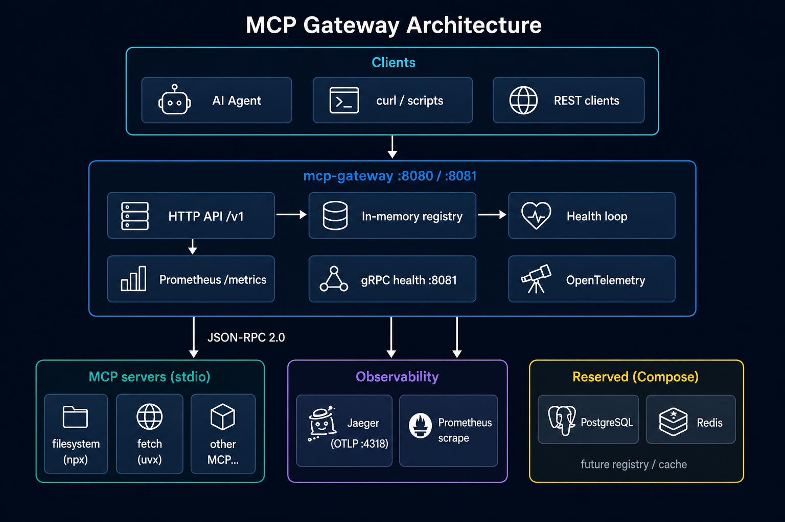
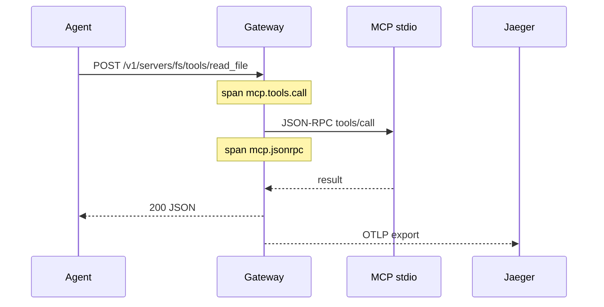

# mcp-gateway

[](https://github.com/kantik001/mcp-gateway/actions/workflows/ci.yml)
[](https://go.dev/)
[](LICENSE)
[](https://modelcontextprotocol.io/)

**HTTP gateway for the Model Context Protocol** — expose MCP tools to any agent over a simple REST API.

`mcp-gateway` runs MCP servers as stdio subprocesses and proxies `tools/list` / `tools/call` through a production-minded Go service: registry, health checks, structured logs, and Prometheus metrics.

| | |
|---|---|
| **Agent-friendly HTTP** | No custom MCP SDK required on the client — plain JSON + curl |
| **Tool schema for agents** | `GET /v1/tools/schema` — OpenAI function-calling JSON for dynamic tool discovery |
| **Observability** | OpenTelemetry traces (Jaeger), Prometheus metrics + per-tenant cost estimate, request IDs |
| **gRPC health** | `grpc.health.v1.Health/Check` on `:8081` for probes and staff-level infra signal |
| **Declarative registry** | Declare servers in YAML; gateway starts and watches them |
| **Docker-first** | One `docker compose up` brings gateway + Jaeger (+ reserved Postgres/Redis) and sample MCP servers |

---

## Why this exists

MCP servers speak JSON-RPC over stdio. Agents and orchestrators often speak HTTP. Bridging that gap usually means embedding an MCP client in every app.

**mcp-gateway** is that bridge once: register MCP servers, call tools over HTTP, scrape metrics, and keep register/health failures from taking down the gateway process. (Tool calls are not blocked solely because a server is marked unhealthy — that flag is for metrics and listing.)

---

## Architecture



**Message flow:** client → HTTP `/v1` → in-memory registry → MCP stdio (`tools/list` / `tools/call`) → JSON response; metrics on `/metrics`, traces via OTLP to Jaeger, gRPC health on `:8081`.

---

## Quickstart

### Docker Compose

```bash
git clone https://github.com/kantik001/mcp-gateway.git
cd mcp-gateway
docker compose up --build -d
# first boot may take 30–60s while MCP packages download
```

Runtime image uses **Node 22** (`npx`) and **uv** for sample MCP servers. Builder image is Go **1.25**.

```bash
curl -s http://localhost:8080/health
curl -s http://localhost:8080/v1/servers
curl -s http://localhost:8080/v1/tools/schema | head -c 400; echo
curl -s http://localhost:8080/v1/servers/filesystem/tools

curl -s -X POST http://localhost:8080/v1/servers/filesystem/tools/read_file \
  -H "Content-Type: application/json" \
  -d '{"args":{"path":"/data/README.md"}}'

curl -s http://localhost:8080/metrics | grep -E 'mcp_tool_calls_total|mcp_tool_cost_total|mcp_server_up'

# gRPC health (go install github.com/fullstorydev/grpcurl/cmd/grpcurl@latest)
grpcurl -plaintext localhost:8081 grpc.health.v1.Health/Check

# Traces: http://localhost:16686  (service name from OTEL_SERVICE_NAME, default mcp-gateway)
```

Helper smoke script (Linux / macOS / Git Bash) — health, servers, schema, tool call, metrics, optional gRPC:

```bash
bash scripts/test-mcp.sh
```

### Local (Go)

Requirements: Go **1.25+**. For live MCP servers also install Node.js (`npx`) and/or [uv](https://docs.astral.sh/uv/) (`uvx`).

```bash
cp .env.example .env
make tidy && make test && make build && make run
```

Edit `config/servers.yaml` so filesystem roots match your machine when not using Docker.

---

## HTTP API

| Method | Path | Description |
|--------|------|-------------|
| `GET` | `/health` | Gateway liveness → `{"status":"ok"}` |
| `GET` | `/v1/servers` | Registered MCP servers + health |
| `GET` | `/registry` | Alias of `/v1/servers` |
| `GET` | `/v1/tools/schema` | All tools as OpenAI function-calling JSON Schema |
| `GET` | `/v1/servers/{name}/tools` | MCP `tools/list` |
| `POST` | `/v1/servers/{name}/tools/{tool}` | MCP `tools/call` |
| `GET` | `/metrics` | Prometheus metrics |

gRPC (port `GRPC_PORT`, default **8081**): `grpc.health.v1.Health/Check` → `SERVING`.

**`GET /v1/servers`** returns `{"servers":[{"name","description","healthy","command","enabled"}, …]}`.

**`GET /v1/tools/schema`** returns `{"tools":[{"type":"function","function":{…},"server","mcp_tool"}, …]}`.

### Call a tool

**Request**

```http
POST /v1/servers/filesystem/tools/read_file
Content-Type: application/json

{"args":{"path":"/data/README.md"}}
```

**Response** (success; `isError` is omitted when false)

```json
{
  "content": [{"type": "text", "text": "…"}]
}
```

### Error semantics

| Situation | HTTP status | Body |
|-----------|-------------|------|
| Unknown server | `404` | `{"error":"…"}` |
| Invalid JSON body | `400` | `{"error":"…"}` |
| MCP JSON-RPC / transport failure | `502` | `{"error":"…"}` |
| Per-call timeout (`TOOL_CALL_TIMEOUT`) | `504` | `{"error":"context deadline exceeded"}` |
| Client canceled the request | `408` | `{"error":"…"}` |
| Tool returned `isError: true` | `200` | MCP `CallToolResult` (agent reads `isError`) |
| Missing / wrong API key | `401` | `{"error":"unauthorized"}` |

Tool-level failures are still successful JSON-RPC responses — the gateway keeps HTTP **200** so clients can inspect `content` and `isError` without conflating them with upstream outages.

### Optional API key

Set `API_KEY` and send `X-API-Key: <key>` or `Authorization: Bearer <key>`.  
`/health` and `/metrics` stay open for probes.

---

## Configuration

**YAML** — `config/servers.yaml`:

```yaml
servers:
  - name: filesystem
    description: Local filesystem access via MCP
    command: npx
    args: ["-y", "@modelcontextprotocol/server-filesystem", "/data"]
    enabled: true
    # optional extra process env (KEY: VALUE)
    # env:
    #   MY_FLAG: "1"
```

**Environment** (overrides):

| Variable | Default | Purpose |
|----------|---------|---------|
| `PORT` | `8080` | HTTP listen port |
| `GRPC_PORT` | `8081` | gRPC health listen port |
| `CONFIG_PATH` | `config/servers.yaml` | Servers manifest |
| `LOG_LEVEL` | `info` | `debug` / `info` / `warn` / `error` |
| `HEALTH_CHECK_INTERVAL` | `30s` | Background MCP health checks |
| `TOOL_CALL_TIMEOUT` | `30s` | Per-request timeout for `tools/list` and `tools/call` |
| `API_KEY` | _(empty)_ | Optional shared secret |
| `DEFAULT_TENANT` | `default` | Tenant label when `X-Tenant-ID` is absent |
| `OTEL_EXPORTER_OTLP_ENDPOINT` | _(empty / noop)_ | OTLP HTTP endpoint (Compose: `http://jaeger:4318`) |
| `OTEL_SERVICE_NAME` | `mcp-gateway` | Service name in Jaeger / OTLP resource |
| `OTEL_SDK_DISABLED` | _(unset)_ | Set `true` to force no-op tracer |
| `DATABASE_URL` | _(unused in MVP)_ | Reserved for future registry |

See [`.env.example`](.env.example).

---

## Observability

### Distributed tracing (OpenTelemetry → Jaeger)

Compose starts **Jaeger all-in-one**. The gateway exports OTLP/HTTP traces when `OTEL_EXPORTER_OTLP_ENDPOINT` is set.

**Span tree (typical tool call):**

```text
HTTP POST /v1/servers/{server}/tools/{tool}   (otelhttp)
  └─ mcp.tools.call
       └─ mcp.jsonrpc  (tools/call)
```

Open **http://localhost:16686** → Search service `mcp-gateway` (or `OTEL_SERVICE_NAME`) → inspect a recent trace.  
Logs include `trace_id` next to `request_id` for correlation.

Without an OTLP endpoint (or with `OTEL_SDK_DISABLED=true`) the SDK uses a no-op tracer — unit tests stay offline-friendly.



### Prometheus metrics

| Metric | Type | Labels |
|--------|------|--------|
| `mcp_tool_calls_total` | counter | `server`, `tool`, `status` (`ok` / `error` / `tool_error`) |
| `mcp_tool_cost_total` | counter | `server`, `tool`, `tenant` |
| `mcp_server_up` | gauge | `server` |
| `mcp_tool_call_duration_seconds` | histogram | `server`, `tool` |
| `mcp_gateway_http_requests_total` | counter | `method`, `path`, `status` (HTTP status **text**, e.g. `OK`, `Not Found`) |

`mcp_tool_cost_total` is an **MVP token estimate** (`≈ (len(args)+len(result))/4`, min 1). Pass `X-Tenant-ID` (or `?tenant=`) to attribute cost; default tenant is `DEFAULT_TENANT`.

```bash
curl -s http://localhost:8080/metrics | grep mcp_tool_cost_total
```

### Graceful shutdown

On `SIGINT` / `SIGTERM` the gateway:

1. Cancels the background health-check loop
2. Stops accepting new HTTP connections (`Shutdown`, 15s budget)
3. Stops the gRPC health server
4. Closes the registry — each MCP stdio subprocess gets a graceful close, then `Kill` after 3s if still alive

Structured logs are JSON via `log/slog`.

---

## Development

| Target | Action |
|--------|--------|
| `make build` | Build binary → `bin/` |
| `make test` | Run unit tests |
| `make coverage` | Coverage for `internal/mcp` |
| `make run` | Build and start |
| `make lint` | golangci-lint |
| `make tidy` | `go mod tidy` |
| `make docker-up` | Compose up (detached) |
| `make docker-down` | Compose down |

```
cmd/server/           entrypoint (HTTP + gRPC health)
internal/mcp/         JSON-RPC client + stdio transport
internal/registry/    in-memory registry + health loop
internal/proxy/       HTTP handlers + middleware + tool schema
internal/config/      YAML + env loading
internal/metrics/     Prometheus
internal/otelx/       OpenTelemetry tracer setup
internal/grpchealth/  grpc.health.v1 server
pkg/mcp/              public type re-exports (optional for consumers)
config/servers.yaml   declarative MCP servers
```

---

## Roadmap (post-MVP)

- [ ] Postgres-backed registry
- [ ] Redis tool-result cache
- [x] OpenTelemetry traces
- [ ] SSE / streaming tool results
- [ ] Multi-tenant API keys / real pricing API for `mcp_tool_cost_total`

Not in scope for MVP: Web UI, RAG/LLM orchestration.

---

## Contributing

See [CONTRIBUTING.md](CONTRIBUTING.md). Security reports: [SECURITY.md](SECURITY.md).

## License

[Apache License 2.0](LICENSE)
