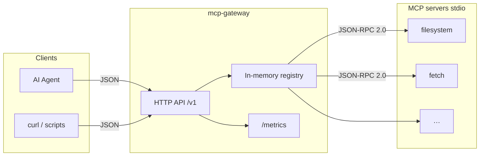

# mcp-gateway

[](https://github.com/kantik001/mcp-gateway/actions/workflows/ci.yml)
[](https://go.dev/)
[](LICENSE)
[](https://modelcontextprotocol.io/)

**HTTP gateway for the Model Context Protocol** — expose MCP tools to any agent over a simple REST API.

`mcp-gateway` runs MCP servers as stdio subprocesses and proxies `tools/list` / `tools/call` through a production-minded Go service: registry, health checks, structured logs, and Prometheus metrics.

| | |
|---|---|
| **Agent-friendly HTTP** | No custom MCP SDK required on the client — plain JSON + curl |
| **Declarative registry** | Declare servers in YAML; gateway starts and watches them |
| **Observability** | Request IDs, slog JSON logs, `/metrics` (`mcp_tool_calls_total`, `mcp_server_up`) |
| **Docker-first** | One `docker compose up` brings gateway + sample MCP servers |

---

## Why this exists

MCP servers speak JSON-RPC over stdio. Agents and orchestrators often speak HTTP. Bridging that gap usually means embedding an MCP client in every app.

**mcp-gateway** is that bridge once: register MCP servers, call tools over HTTP, scrape metrics, and keep unhealthy servers from taking down the control plane.

---

## Architecture



---

## Quickstart

### Docker Compose

```bash
git clone https://github.com/kantik001/mcp-gateway.git
cd mcp-gateway
docker compose up --build -d
# first boot may take 30–60s while MCP packages download
```

```bash
curl -s http://localhost:8080/health
curl -s http://localhost:8080/v1/servers
curl -s http://localhost:8080/v1/servers/filesystem/tools

curl -s -X POST http://localhost:8080/v1/servers/filesystem/tools/read_file \
  -H "Content-Type: application/json" \
  -d '{"args":{"path":"/data/README.md"}}'

curl -s http://localhost:8080/metrics | grep -E 'mcp_tool_calls_total|mcp_server_up'
```

Helper script (Linux / macOS / Git Bash):

```bash
bash scripts/test-mcp.sh
```

### Local (Go)

Requirements: Go 1.23+. For live MCP servers also install Node.js (`npx`) and/or [uv](https://docs.astral.sh/uv/) (`uvx`).

```bash
cp .env.example .env
make tidy && make test && make build && make run
```

Edit `config/servers.yaml` so filesystem roots match your machine when not using Docker.

---

## HTTP API

| Method | Path | Description |
|--------|------|-------------|
| `GET` | `/health` | Gateway liveness |
| `GET` | `/v1/servers` | Registered MCP servers + health |
| `GET` | `/registry` | Alias of `/v1/servers` |
| `GET` | `/v1/servers/{name}/tools` | MCP `tools/list` |
| `POST` | `/v1/servers/{name}/tools/{tool}` | MCP `tools/call` |
| `GET` | `/metrics` | Prometheus metrics |

### Call a tool

**Request**

```http
POST /v1/servers/filesystem/tools/read_file
Content-Type: application/json

{"args":{"path":"/data/README.md"}}
```

**Response**

```json
{
  "content": [{"type": "text", "text": "…"}],
  "isError": false
}
```

### Optional API key

Set `API_KEY` and send `X-API-Key: <key>` or `Authorization: Bearer <key>`.  
`/health` and `/metrics` stay open for probes.

---

## Configuration

**YAML** — `config/servers.yaml`:

```yaml
servers:
  - name: filesystem
    description: Local filesystem access via MCP
    command: npx
    args: ["-y", "@modelcontextprotocol/server-filesystem", "/data"]
    enabled: true
```

**Environment** (overrides):

| Variable | Default | Purpose |
|----------|---------|---------|
| `PORT` | `8080` | HTTP listen port |
| `CONFIG_PATH` | `config/servers.yaml` | Servers manifest |
| `LOG_LEVEL` | `info` | `debug` / `info` / `warn` / `error` |
| `HEALTH_CHECK_INTERVAL` | `30s` | Background MCP health checks |
| `API_KEY` | _(empty)_ | Optional shared secret |
| `DATABASE_URL` | _(unused in MVP)_ | Reserved for future registry |

See [`.env.example`](.env.example).

---

## Metrics

| Metric | Type | Labels |
|--------|------|--------|
| `mcp_tool_calls_total` | counter | `server`, `tool`, `status` |
| `mcp_server_up` | gauge | `server` |
| `mcp_tool_call_duration_seconds` | histogram | `server`, `tool` |
| `mcp_gateway_http_requests_total` | counter | `method`, `path`, `status` |

---

## Development

| Target | Action |
|--------|--------|
| `make build` | Build binary → `bin/` |
| `make test` | Run unit tests |
| `make coverage` | Coverage for `internal/mcp` |
| `make run` | Build and start |
| `make lint` | golangci-lint |
| `make docker-up` | Compose up (detached) |

```
cmd/server/           entrypoint
internal/mcp/         JSON-RPC client + stdio transport
internal/registry/    in-memory registry + health loop
internal/proxy/       HTTP handlers + middleware
internal/config/      YAML + env loading
internal/metrics/     Prometheus
config/servers.yaml   declarative MCP servers
```

---

## Roadmap (post-MVP)

- [ ] Postgres-backed registry
- [ ] Redis tool-result cache
- [ ] OpenTelemetry traces
- [ ] SSE / streaming tool results
- [ ] Multi-tenant API keys

Not in scope for MVP: Web UI, RAG/LLM orchestration, multi-tenancy.

---

## Contributing

See [CONTRIBUTING.md](CONTRIBUTING.md). Security reports: [SECURITY.md](SECURITY.md).

## License

[Apache License 2.0](LICENSE)
